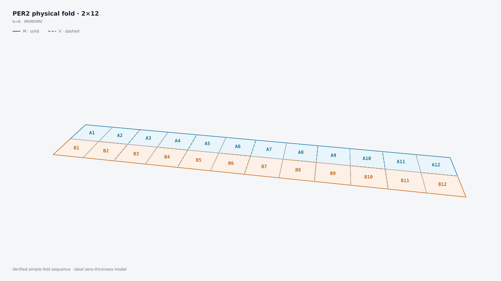
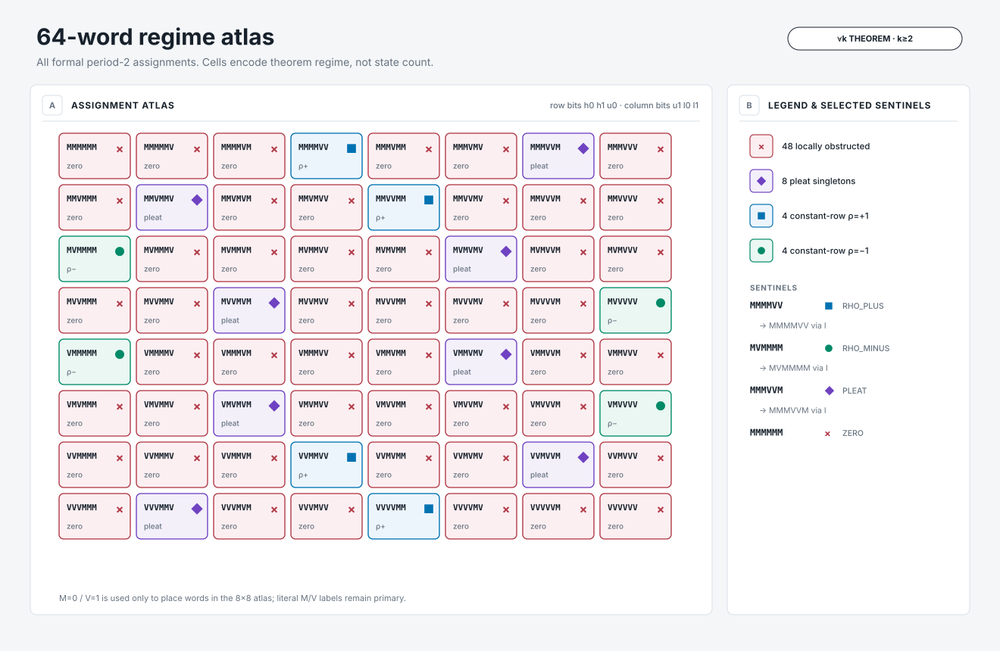
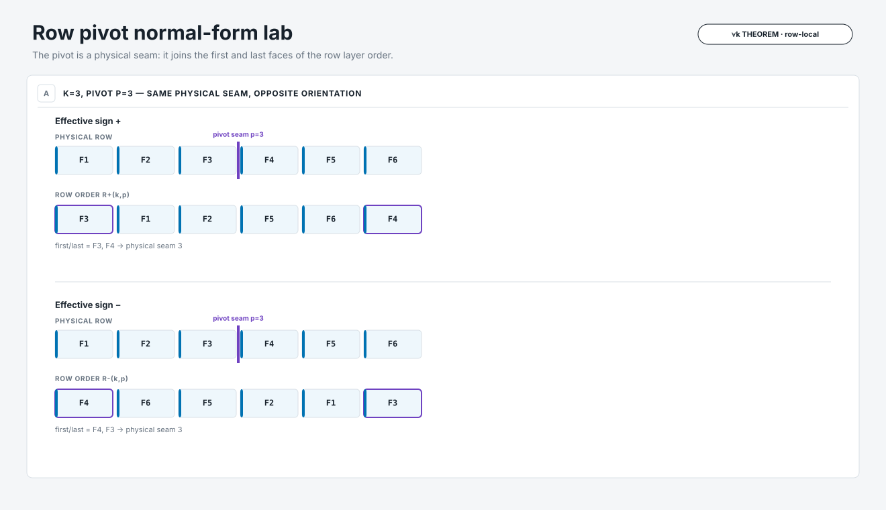
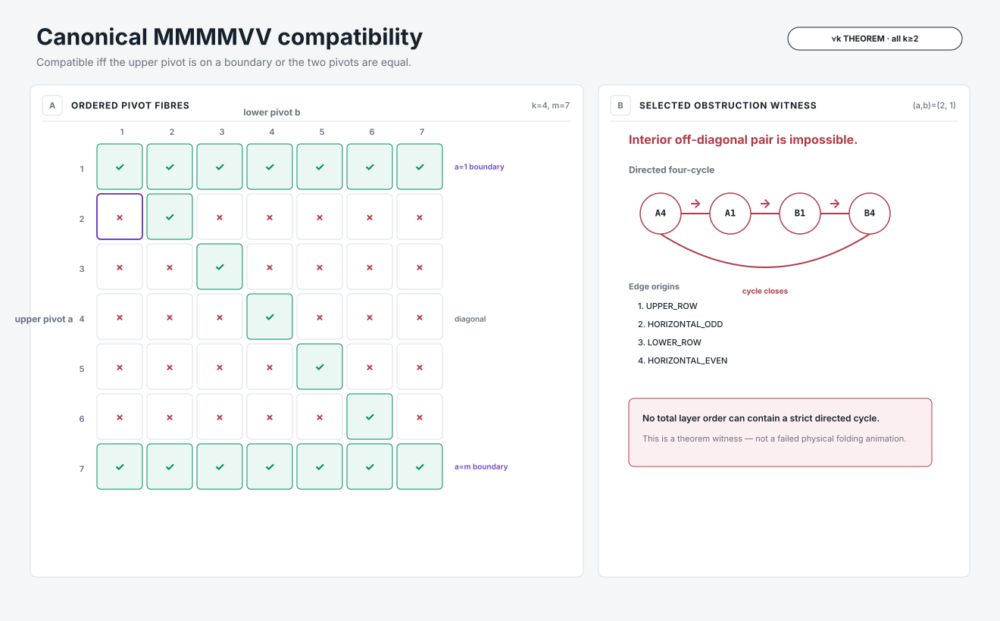
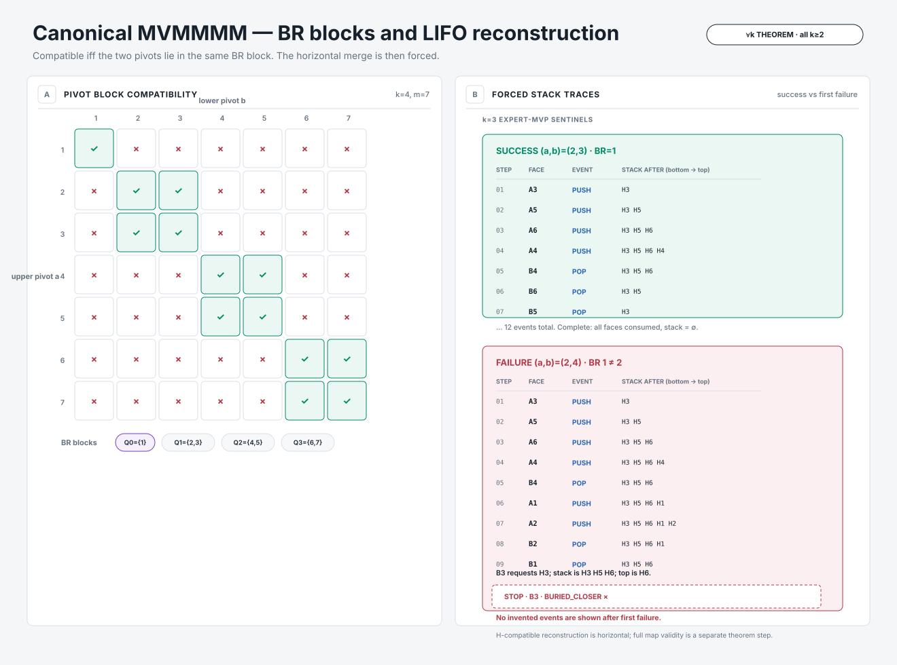

# Exact labelled layer orders for period-2 `2 × 2k` map folding

This repository accompanies the paper **“Exact Labelled Layer-Order Classification for Period-2 Mountain–Valley Assignments on `2 × 2k` Maps.”** It contains the manuscript and supplements, one active scientific Python implementation, independent bounded validation, deterministic reference data, structural visualizations, and a no-backend interactive site.

The classified object is the exact set `F(P,k)` of globally valid **strict labelled total orders of all `4k` faces**. Faces remain labelled. The paper classifies final flat-folded layer orders; it does **not** classify physical folding sequences or continuous collision-free motions.

**Interactive site:** https://spicmaff.github.io/per2-layer-orders/  
**Repository:** https://github.com/spicmaff/per2-layer-orders

[](https://spicmaff.github.io/per2-layer-orders/physical/)

*One validated physical realization for one explicit PER2 state in the ideal zero-thickness model. It is an additional example, not a general consequence of the classification theorem.*

## Classification at a glance

For `k >= 2`, the 64 formal period-2 M/V words split into four regimes:

- **48 locally obstructed** words: empty state set;
- **8 pleat** words: one exact labelled state;
- **4 constant-row `rho=+1`** words, reduced to canonical `MMMMVV`;
- **4 constant-row `rho=-1`** words, reduced to canonical `MVMMMM`.

The two canonical global mechanisms are different:

- **`MMMMVV`:** with `m=2k-1`, pivots `(a,b)` are compatible exactly when `a=1`, `a=m`, or `a=b` — a boundary-or-diagonal pattern.
- **`MVMMMM`:** compatibility is exactly `B_R(a)=B_R(b)`, where `B_R(1)=0` and `B_R(p)=floor(p/2)` for `p>=2` — a singleton block plus `2×2` blocks governed by forced LIFO reconstruction.

The count formulas `0`, `1`, `6k-5`, and `4k-3` are downstream corollaries of these exact state-set descriptions.

## Start here

[Paper PDF](paper/PER2_CANONICAL_MANUSCRIPT.pdf) · [Supplement S1: literal tables](supplements/M4_SUPPLEMENT_S1_TABLES.pdf) · [S2: finite validation](supplements/M4_SUPPLEMENT_S2_VALIDATION.pdf) · [S3: reproduction](supplements/M4_SUPPLEMENT_S3_REPRODUCIBILITY.pdf) · [Reproducibility guide](docs/REPRODUCIBILITY.md) · [Reference data](reference/)

## Structural visualizations

### 1. All 64 period words



### 2. Row pivot normal form



### 3. Canonical `MMMMVV`



### 4. Canonical `MVMMMM`



These are theorem-derived structural explanations. They do not replace the symbolic proofs in the manuscript.

## Map & Layer-Order Explorer

The Pages Explorer keeps the browser renderer-only. Scientific status comes from versioned Python exports.

**`MVMMMM` · LIFO reconstruction (`k=3`).** All 25 pivot pairs `(a,b) in {1,...,5}^2` are exported from Python. The success sentinel `(2,3)` completes with the exact 12-event order

`A3,A5,A6,A4,B4,B6,B5,A1,A2,B2,B1,B3`,

while `(2,4)` stops before `B3` with stack `[H3,H5,H6]`, top `H6`, reason `BURIED_CLOSER`.

**`MMMMVV` · boundary/diagonal compatibility (`k=4`).** Three prepared scenes are exported: diagonal success `(3,3)`, boundary success `(1,4)`, and interior off-diagonal obstruction `(2,3)` with directed cycle

`A4 ≺ A1 ≺ B1 ≺ B4 ≺ A4`.

Compatible scenes show the exact theorem construction plus an independent theorem-blind semantic check. The obstruction scene exports no fake exact state.

Compatibility, row orders, exact states, witnesses, `B_R` values, next events, failure reasons, and semantic validity are **not computed in JavaScript**.

Open prepared routes:

- https://spicmaff.github.io/per2-layer-orders/explorer/?mechanism=mvmmmm&a=2&b=3
- https://spicmaff.github.io/per2-layer-orders/explorer/?mechanism=mvmmmm&a=2&b=4
- https://spicmaff.github.io/per2-layer-orders/explorer/?mechanism=mmmmvv&scene=diagonal
- https://spicmaff.github.io/per2-layer-orders/explorer/?mechanism=mmmmvv&scene=boundary
- https://spicmaff.github.io/per2-layer-orders/explorer/?mechanism=mmmmvv&scene=obstruction&step=4

See [Explorer documentation](docs/MAP_EXPLORER.md).

## Reproduce bounded finite validation

The semantic validator is theorem-blind: it knows physical faces/creases, checkerboard orientation, M/V precedence, target classes, and Butterfly noncrossing, but it does **not** know the 48/16 split, the canonical pivot criteria, or the count formulas.

```bash
python -m pip install -e '.[test]'
per2 finite-validation --full
```

The full replay checks all 64 formal words at `k=2`, exact canonical pivot fibres, all five exact symmetry actions, and the separate `k=1` boundary model.

Quick checks:

```bash
pytest -q
per2 classify MMMMVV --k 4
per2 compatibility MMMMVV --k 4 --a 2 --b 1
per2 compatibility MVMMMM --k 3 --a 2 --b 4
```

Minimal trust-boundary examples are in [`examples/`](examples/).

## What computation does not prove

Finite computation is **validation, not the all-`k` proof**. The infinite-family statements are established symbolically in the paper. The validation layer is the only place that intentionally compares theorem predictions with independently enumerated exact states.

Likewise, the separately validated `k=6` physical example certifies one explicit simple-fold realization only. It does not imply that every state classified by the paper has a validated physical folding trajectory.

## Scientific code boundary

- `per2.semantics`: theorem-blind membership oracle and bounded enumeration.
- `per2.theory`: invariants, classification, row normal forms, pivots, compatibility criteria, witnesses, and deterministic theorem-side traces.
- `per2.validation`: bounded comparison between those two layers.
- `per2.export`: deterministic machine-readable exports with provenance.
- `visualization/`: render-only adapters and deterministic static SVGs.
- `web/`: no-backend presentation shell consuming exported records.

The browser must not independently classify a word, decide compatibility, validate a state, compute `B_R/B_L`, derive a witness, or invent a next event.

## One validated physical example

[`assets/physical_k6/`](assets/physical_k6/) contains an explicit validated `k=6`, `2×12`, `MVMVMV` simple-fold realization in the ideal zero-thickness model.

[MP4](assets/physical_k6/final.mp4) · [WebM](assets/physical_k6/final.webm) · [trajectory JSON](assets/physical_k6/trajectory.json) · [validation JSON](assets/physical_k6/validation.json) · [FOLD file](assets/physical_k6/physical_case.fold)

## Repository map

- `paper/` — manuscript PDF and LaTeX source;
- `supplements/` — publication supplements S1–S3;
- `src/per2/` — active scientific Python package;
- `tests/` — semantics/theory/validation/regression tests;
- `reference/` — committed theorem-derived and independently validated records with schemas and manifests;
- `reproduction/` — thin publication-reproduction wrappers;
- `visualization/` — deterministic static visualization source and outputs;
- `web/` — no-backend Pages source;
- `assets/physical_k6/` — one separately validated physical example;
- `docs/` — scope, provenance, accessibility, release, and development documentation.

## Citation

Use [`CITATION.cff`](CITATION.cff). The repository intentionally contains no invented DOI or journal metadata. Zenodo metadata should be added only after an actual archived release exists.

## Licensing status

No reuse license is asserted without the rights holder's approval. Different content classes may require different licenses; see [`LICENSES/README.md`](LICENSES/README.md). Until explicit licenses are added, normal copyright restrictions apply.
